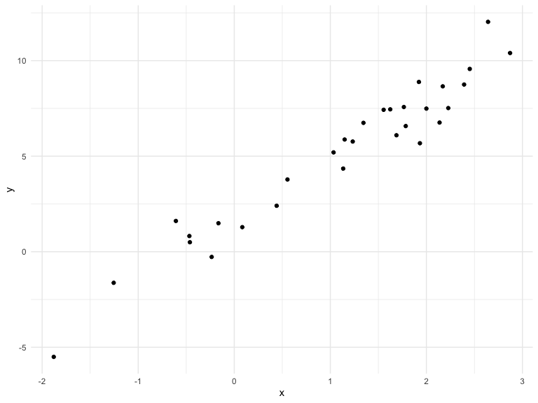

Writing\_Function
================

## get started

We’re going to write some functions.

``` r
x = rnorm(n = 30, mean = 4, sd = 2.3)
x_again = rnorm(n = 20, mean = 6, sd = 0.3)
y = rnorm(n = 30, mean = 24, sd = 2.3)

(x - mean(x)) / sd(x)
```

    ##  [1]  0.20517855  0.05164195  0.50036892 -0.20063029 -0.51772751
    ##  [6]  0.36451826  1.05657877 -0.21887514 -0.30961632  0.21966514
    ## [11]  0.25307726  1.97878757  0.65499583 -0.64163553  1.00730520
    ## [16] -0.29947817 -1.57094478 -1.72014417 -1.26342446  1.21034503
    ## [21] -0.80225816  0.10680430  1.16270651  1.99055274  0.44151544
    ## [26] -0.35614672 -1.26427451  0.27620376 -0.18358982 -2.13149969

``` r
(x_again - mean(x_again)) / sd(x_again)
```

    ##  [1] -1.60348466  0.03873355  0.45888324 -1.06974953 -0.78921337
    ##  [6] -1.65682649  1.87151841 -1.00102485  0.34215313  0.51500014
    ## [11] -0.53026702 -0.42784501  0.54406343 -0.72066616  1.19536503
    ## [16] -0.51920667  1.33614392  0.17361257  1.32518234  0.51762800

Now a function.

``` r
z_score = function(x_arg) {
## condition execution
  if (!is.numeric(x_arg)){
    stop( "x should be numeric")
    } else if (length(x_arg) < 3){
    stop("x should be longer than 3")
    }
  
  (x - mean(x_arg)) /  sd(x_arg)
  
}
```

Try out the
    function.

``` r
z_score(x_arg = y)
```

    ##  [1]  -9.001889  -9.160914  -8.696147  -9.422204  -9.750637  -8.836853
    ##  [7]  -8.120054  -9.441101  -9.535086  -8.986885  -8.952278  -7.164879
    ## [13]  -8.535992  -9.878974  -8.171089  -9.524586 -10.841503 -10.996036
    ## [19] -10.522990  -7.960791 -10.045338  -9.103780  -8.010133  -7.152694
    ## [25]  -8.757104  -9.583280 -10.523870  -8.928325  -9.404555 -11.422096

``` r
z_score(x = 3)
```

    ## Error in z_score(x = 3): x should be longer than 3

``` r
z_score(x = c(TRUE,TRUE,FALSE,TRUE))
```

    ## Error in z_score(x = c(TRUE, TRUE, FALSE, TRUE)): x should be numeric

``` r
## convert them to numeric
z_score(x = "my name is jeff")
```

    ## Error in z_score(x = "my name is jeff"): x should be numeric

``` r
z_score(x = iris)  ## iris is a dataframe 
```

    ## Error in z_score(x = iris): x should be numeric

## multiple outputs

``` r
mean_and_sd = function(input_x){
  if (!is.numeric(input_x)){
    stop( "x should be numeric")
    } else if (length(input_x) < 3){
    stop("x should be longer than 3")
    }
  ## into a data frame with tibble
    list(
    mean_input = mean(input_x),
    sd_input = sd(input_x),
    z_score = (input_x - mean(input_x))/sd(input_x)
    ) 
}
```

test this function

``` r
mean_and_sd(input_x = y)
```

    ## $mean_input
    ## [1] 24.06734
    ## 
    ## $sd_input
    ## [1] 2.095193
    ## 
    ## $z_score
    ##  [1]  0.872831372 -0.582662016  0.018052769  1.142585465 -0.202038340
    ##  [6]  1.185425217 -0.628740805 -1.709015035  0.508500634  0.638600841
    ## [11] -1.292771871  0.002646865 -0.063363718  1.421030857  1.025384287
    ## [16]  1.525708387 -1.377064307  0.125191384  0.050848218  1.468941009
    ## [21]  1.061589156 -0.716435625 -1.298566401 -0.152277463 -0.719819537
    ## [26] -0.955088483  0.121401147  0.519254874  0.224236672 -2.214385552

## Multiple inputs

``` r
sim_data = tibble(
  x = rnorm(30, mean = 1, sd = 1),
  y = 2 + 3 * x + rnorm(30, 0, 1)
)

sim_data %>%
  ggplot(aes(x = x, y = y)) + 
  geom_point() 
```



``` r
ls_fit = lm(y ~ x, data = sim_data)
  
beta0_hat = coef(ls_fit)[1] ##intercept (first coefficient)
beta1_hat = coef(ls_fit)[2] ##slope (second coefficient)
```

``` r
sim_regression = function(n, beta0 = 2, beta1 = 3) {
  
  sim_data = tibble(
    x = rnorm(n, mean = 1, sd = 1),
    y = beta0 + beta1 * x + rnorm(n, 0, 1)
  )
  
  ls_fit = lm(y ~ x, data = sim_data)
  
  tibble(
    beta0_hat = coef(ls_fit)[1],
    beta1_hat = coef(ls_fit)[2]
  )

}

sim_regression(n = 3000, beta0 = 17, beta1 = -3)
```

    ## # A tibble: 1 x 2
    ##   beta0_hat beta1_hat
    ##       <dbl>     <dbl>
    ## 1      17.0     -3.00

``` r
## we don't have to name, it will be put in  order. 
sim_regression(3000,2,3)
```

    ## # A tibble: 1 x 2
    ##   beta0_hat beta1_hat
    ##       <dbl>     <dbl>
    ## 1      2.01      2.98

``` r
sim_regression(n = 4, beta0 = 24)
```

    ## # A tibble: 1 x 2
    ##   beta0_hat beta1_hat
    ##       <dbl>     <dbl>
    ## 1      24.0      2.72

``` r
url = "https://www.amazon.com/product-reviews/B00005JNBQ/ref=cm_cr_arp_d_viewopt_rvwer?ie=UTF8&reviewerType=avp_only_reviews&sortBy=recent&pageNumber=1"

dynamite_html = read_html(url)

review_titles = dynamite_html %>%
  html_nodes("#cm_cr-review_list .review-title") %>%
  html_text()

review_stars = dynamite_html %>%
  html_nodes("#cm_cr-review_list .review-rating") %>%
  html_text()

review_text = dynamite_html %>%
    html_nodes(".review-data:nth-child(4)") %>%
    html_text()

reviews = tibble(
  title = review_titles,
  stars = review_stars,
  text = review_text
)
```

now as a function

``` r
read_page_reviews = function(page_url){
   h = read_html(url)
  
  review_titles = h %>%
    html_nodes("#cm_cr-review_list .review-title") %>%
    html_text()
  
  review_stars = h %>%
    html_nodes("#cm_cr-review_list .review-rating") %>%
    html_text() %>%
    str_extract("\\d") %>%
    as.numeric()
  
  review_text = h %>%
    html_nodes(".review-data:nth-child(4)") %>%
    html_text()
  
  tibble(
    title = review_titles,
    stars = review_stars,
    text = review_text
  )
}
```
